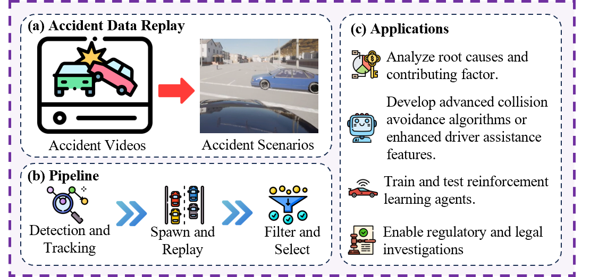

# 🚗 Scenario Generation from Accident Videos

Author: [Yansong Qu](https://ys-qu.github.io/)

This repository extracts object trajectories from accident videos in the [CCD dataset](https://github.com/Cogito2012/CarCrashDataset?tab=readme-ov-file#download)
 using object detection and tracking methods. The extracted trajectories are then replayed to reconstruct realistic accident scenes in the CARLA simulator.

The object detection and tracking module is based on [CenterTrack](https://github.com/xingyizhou/CenterTrack?tab=readme-ov-file)
, with the default model being `nuscenes_3d_tracking`. However, its performance on the CCD dataset is not ideal. To improve adaptation, an unsupervised domain adaptation approach was implemented to enhance detection and tracking on CCD data. Since the CCD dataset does not provide detection or tracking labels, it remains uncertain whether the adaptation effectively improves model performance.

This limitation affects the quality of trajectory extraction, leading to missing clips, misclassifications, and inaccurate scene reconstructions. Many generated scenes did not meet quality expectations, so manual filtering was applied to remove unsatisfactory results.

This repository also partially extends reinforcement learning (RL) support. However, due to the imperfect scene generation quality, we recommend using this project primarily as an experimental prototype and demonstration of digital twin capabilities.

## Accident Trajectory Replay: Overview

This repository extracts trajectories from accident videos via detection and multi-object tracking, then spawns agents and replays the scene in **CARLA**.  
Unsupervised domain adaptation can be optionally applied to improve cross-dataset generalization; low-quality cases are filtered before use.

  
*Figure 1. Framework.*  
(a) Accident data replay. (b) Pipeline. (c) Representative applications — root-cause analysis, collision avoidance/ADAS, RL training & testing, and regulatory evidence support.

---

## Detection & Tracking Example

A [CenterTrack](https://github.com/xingyizhou/CenterTrack) -based module detects and tracks objects, maintaining consistent identities across frames to form trajectories.  
This step is critical for accurate replay fidelity downstream.

  
*Figure 2. Detection & Tracking.*  
Multi-object tracking preserves consistent IDs to build reliable trajectories.

---

## Generated Scene Examples

Using the extracted trajectories, agents are spawned in CARLA to reconstruct representative accident scenarios  
(e.g., pedestrian, lateral, and rear-end collisions).

  
*Figure 3. Replay Results.*  
Reconstructed scenes across multiple accident types using trajectory replay from the [CCD dataset](https://github.com/shad0w47/CCD-dataset).


## 📥 Installation
1. Install `CARLA 0.9.15` from [here](https://github.com/carla-simulator/carla/releases/tag/0.9.15).
2. Create a conda env and install the requirements:
```bash
conda create -n videoscg python=3.10
conda activate videoscg
pip install torch==1.12.1+cu113 torchvision==0.13.1+cu113 torchaudio==0.12.1 --extra-index-url https://download.pytorch.org/whl/cu113
pip install -r requirements.txt
```

## Adjust hyper-parameters
Make sure that you adjust the hyper-parameters in `config_yaml` folder.

## 🛠️ Usage

### Run
```bash
python main.py --CARLA_ROOT /path/to/carla/root   # make sure you have changed the paths
```

## Reference
If you find this code repository is helpful, please cite:
```bash
@misc{huang2025skydrivedistributedmultiagentsimulation,
      title={Sky-Drive: A Distributed Multi-Agent Simulation Platform for Human-AI Collaborative and Socially-Aware Future Transportation}, 
      author={Zilin Huang and Zihao Sheng and Zhengyang Wan and Yansong Qu and Yuhao Luo and Boyue Wang and Pei Li and Yen-Jung Chen and Jiancong Chen and Keke Long and Jiayi Meng and Yue Leng and Sikai Chen},
      year={2025},
      eprint={2504.18010},
      archivePrefix={arXiv},
      primaryClass={cs.RO},
      url={https://arxiv.org/abs/2504.18010}, 
}
```
